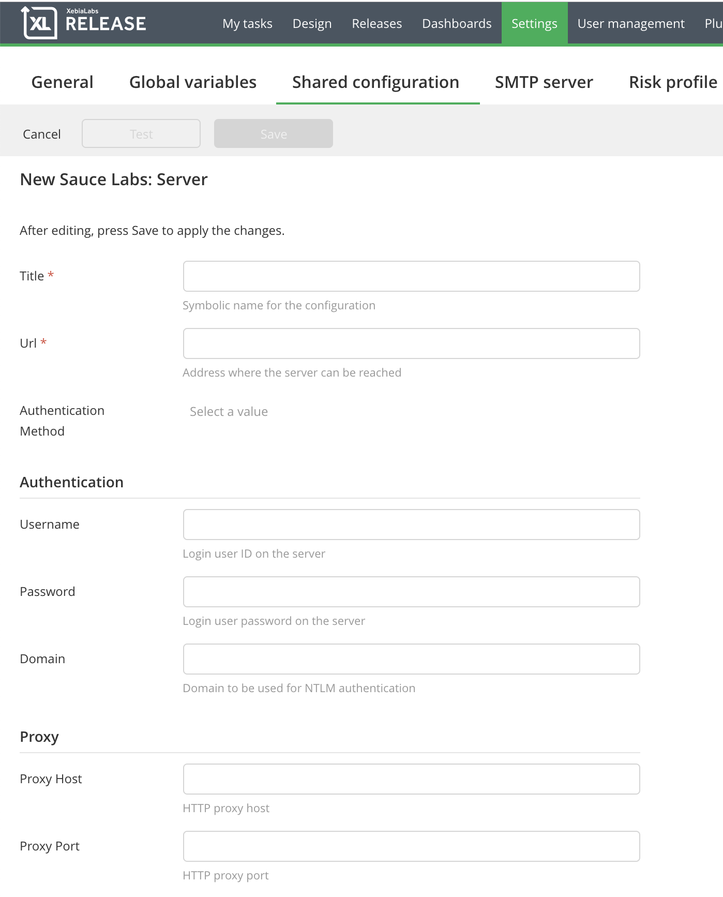
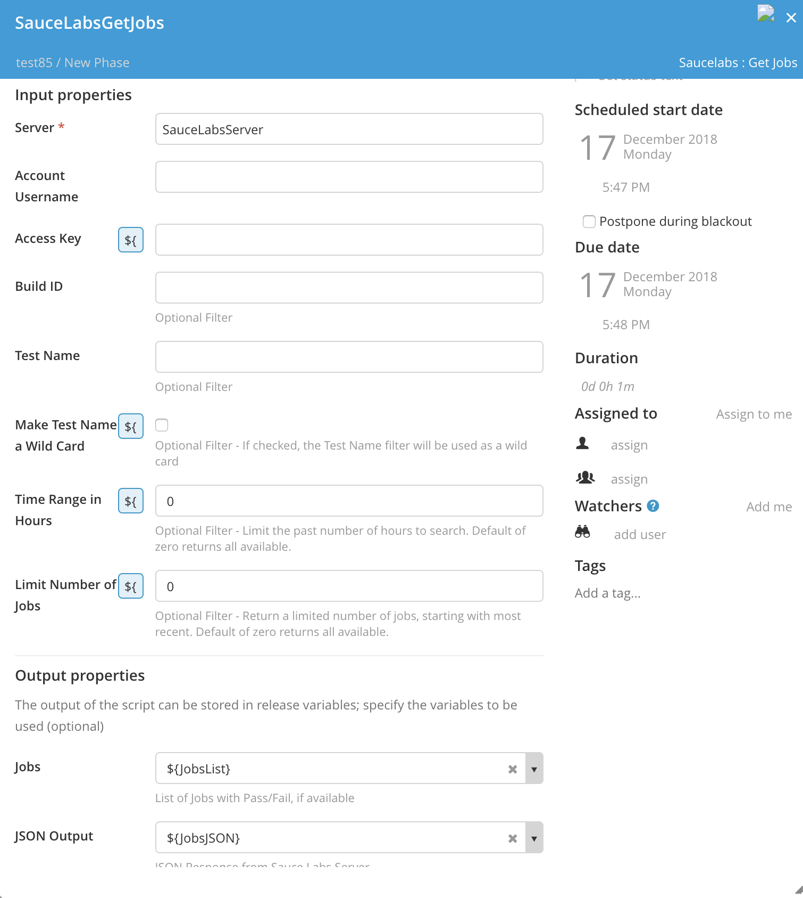
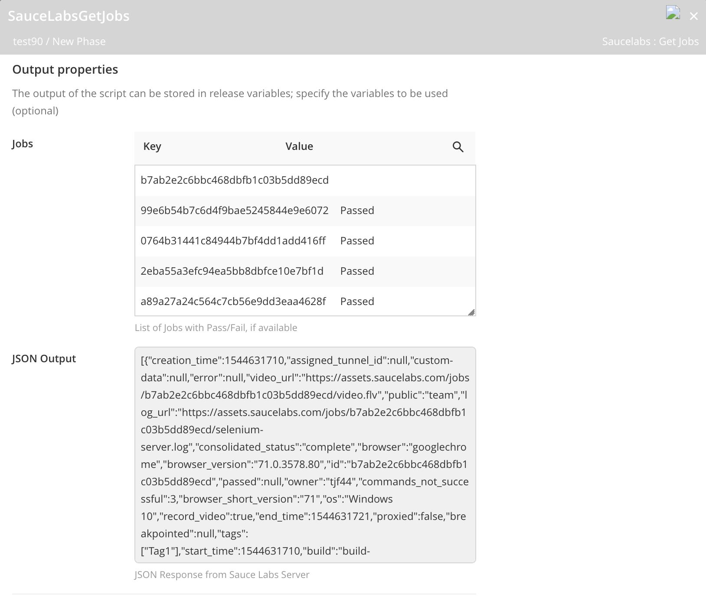
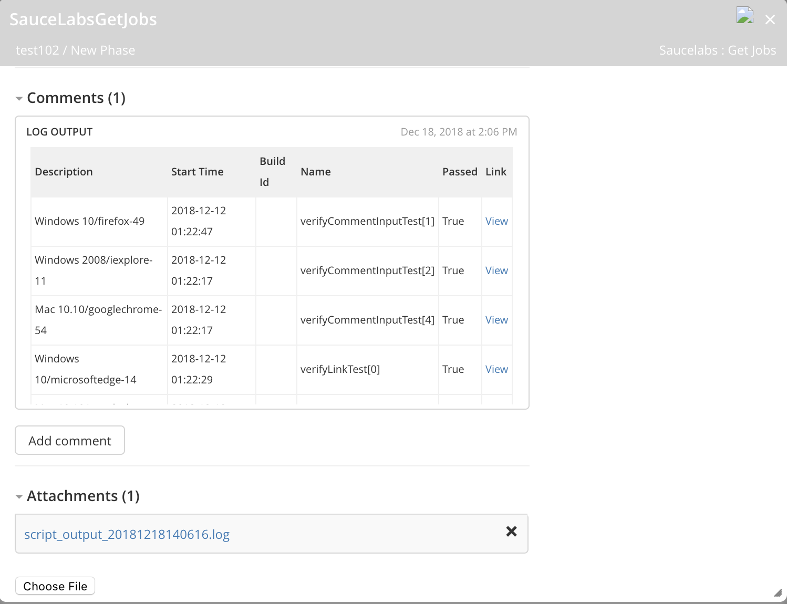

# XL Release Sauce Labs Plugin

# CI status #

[![Build Status][xlr-saucelabs-travis-image] ][xlr-saucelabs-travis-url]

[xlr-saucelabs-travis-image]: https://travis-ci.org/xebialabs-community/xlr-saucelabs-plugin.svg?branch=master
[xlr-saucelabs-travis-url]: https://travis-ci.org/xebialabs-community/xlr-saucelabs-plugin


# Overview #

This document describes the functionality provided by the xlr-saucelabs-plugin.
This plugin provides the ability to retrieve and display job results from a Sauce Labs server.

See the **XL Release Reference Manual** for background information on XL Release and release concepts.

* **Requirements**
  * **XL Release** 7.5.0+
  * **Sauce Labs Account with REST API** v1.1


# Installation #

* Copy the latest JAR file from the [releases page](https://github.com/xebialabs-community/xlr-saucelabs-plugin/releases) into the `XL_RELEASE_SERVER/plugins/__local__` directory.
* Restart the XL Release server.


# Usage #

## Configure Server ##

Begin by configuring one or more Sauce Lab servers.  Navigate to **Settings -> Shared configuration** and add a Sauce Labs: Server.



Enter a descriptive name for this server.

### URL ###

Enter the full URL to the Sauce Labs server from which job results can be retrieved.  Include protocol (http or https) and port number if applicable.  For example: http://saucelabs.com

### Authentication Method ###

Choose the Basic Method from the drop down list. You may need to click the entry area to activate the drop down.

### Username ###

Enter the account username.

### Password ###

Enter the account ACCESS KEY in the password entry field

### Proxy ###

Optional proxy information if you access the SauceLabs server through a proxy.

---

## Get Jobs Task ##

In your SDLC templates, you can add a task of type **SauceLabs -> Get Jobs** as shown below.  When this task executes, information about Sauce Labs jobs that meet the search criteria, will be retrieved.



### Server ###

The Sauce Labs server from which job information will be retrieved.  

### Account Username ###

This optional entry can be used to override the Server username.

### Account Access Key ###

This optional entry can be used to override the Server access key/password.

### Build ID ###

Optional search criteria filter. If your Sauce Labs jobs have been annotated with Build IDs, you can filter results based on that value.

### Test Name ###

Optional search criteria filter. If your Sauce Labs jobs have been annotated with Test Names, you can filter results based on that value.

### Test Name Wildcard ###

Optional search criteria filter. If this box is checked, the Test Name field entry will be used as a wildcard to filter results.

### Time Range in Hours ###

Optional search criteria filter. Limit the search to jobs started within a specific number of hours in the past. The default of zero will return all available test regardless of when they were started.

### Limit Number of Jobs ###

Optional search criteria filter. Limit the number of jobs returned to the specified number, starting with the most recent. The default of zero will return all available jobs.  

### Output properties ###

The Sauce Labs plugin generates output that you may find useful in later tasks.  First define the variable for the template.  The Jobs output is a map<string,string> and JSON output is a string.

### Jobs ###

A map of key, value pairs. The key is the Job ID and the value is either Passed or Failed, if test have been annotated with these values.

### JSON Output ###

Filtered Output from the Sauce Labs server, in JSON format. This can be helpful if you want to parse the output and carry out specific tasks based on that information.


---

### Example Output ###

Once the task is complete, you will see output like that shown below...



### Example Log Output ###

Log output displays the retrived job meta data, including a link to the Sauce Labs server job page, in table format.



# Developers #

Build and package the plugins with...

```bash
./gradle assemble
```

Run end to end integration tests
```bash
./gradlew clean integrationTesting
```

[More information about end to end integration testing](DevAndTesting.md)